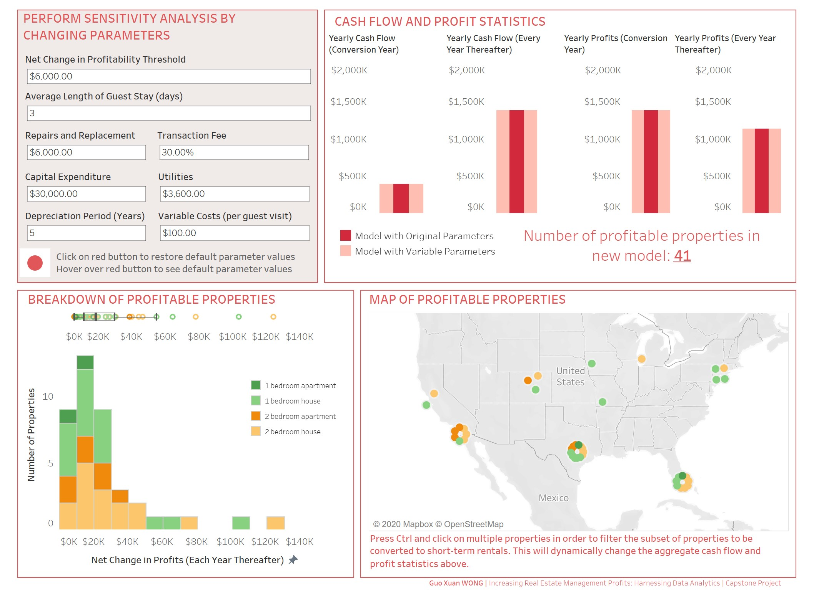

# Increasing Real Estate Management Profits
This is my submission for the Capstone Project of the Coursera Specialization "Excel to MySQL: Analytic Techniques for Business" offered by Duke University. The objective of the project is to convince the fictitious property management company to increase its profits by converting some of their properties to short-term rental properties. 

# Methods
1) Use MySQL to extract relevant data from a real estate database. 
2) Use Excel to identify opportunities to increase revenue, maximise profits and manage risks. Specifically, I used Excel’s Solver optimization function to identify the rental price and occupancy rate that maximises profits. Optimized values were entered into a financial cash flow and profit model that computed the expected revenue and costs from each property.
3) Create interactive Tableau dashboard to perform financial sensitivity analysis. Specifically, I illustrated the impact on net cash flow and net profit when default parameters were changed.

